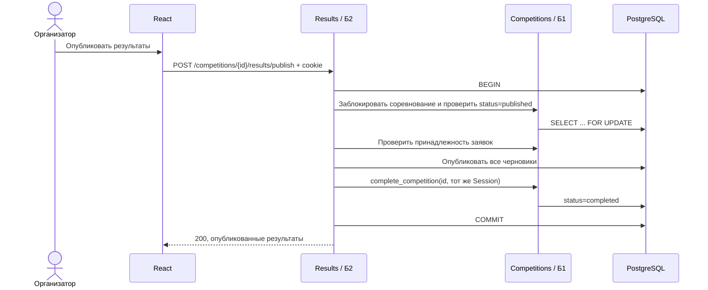
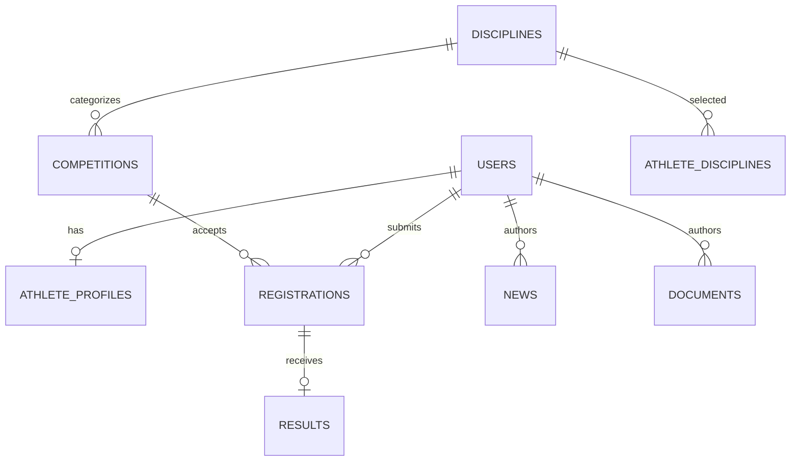

# ТехноСпортФест 2026 — архитектура до MVP

Статус: рабочее решение для старта команды. Основано на переданном ТЗ «Архитектура ТехноСпортФест 2026.md». Неизвестные организационные детали (домен, хостинг, даты сдачи, окончательный язык фронтенда) не блокируют контракт.

## 1. Схема размещения

**Nginx не авторизует пользователей.** Он обслуживает SPA, завершает TLS и передаёт `/api/v1` в FastAPI. Identity выдаёт JWT в `HttpOnly; SameSite=Lax` cookie (`Secure` в production). FastAPI проверяет подпись, срок действия и роль на каждом защищённом запросе. Для всех изменяющих запросов сервер требует `Origin`, совпадающий с разрешённым origin приложения. В разработке фронтенд проксирует `/api/v1` на API, сохраняя один origin. Пароли хешируются Argon2id. Публичная регистрация всегда создаёт только `athlete`; организатор создаётся сидом/администратором вне публичного API.

### Вход для MVP

**Решение для MVP: короткий JWT, без Redis и таблицы сессий.** Подписанный токен содержит `sub` (ID пользователя), `role`, `iat`, `exp`; срок жизни — 24 часа, refresh-токена нет. Ключ подписи берётся из переменной окружения. `POST /auth/logout` очищает cookie браузера. Досрочно отозвать уже скопированный JWT нельзя: он действует до `exp`; смена роли также вступит в силу после нового входа или истечения токена. Для демонстрационного MVP это приемлемо.

| Вариант | Когда выбирать | Решение сейчас |
|---|---|---|
| JWT в cookie без refresh | Минимум инфраструктуры и короткий срок действия | Используем |
| Сессии в PostgreSQL | Нужен немедленный отзыв доступа или долгая сессия | Откладываем |
| Сессии в Redis с TTL | Сессии уже нужны, а их чтение стало нагрузкой на БД | Откладываем |

JWT в cookie требует защиты изменяющих запросов от CSRF: используем `SameSite=Lax` и строгую проверку `Origin`, без отдельного CSRF-токена. При отсутствии или несовпадении `Origin` сервер возвращает `403 ORIGIN_INVALID`. Хранить JWT в `localStorage` для этого SPA не планируем.

**Уведомлений и брокера в MVP нет.** Единственный обязательный пользовательский сигнал — результат виден в интерфейсе после публикации. Если после MVP появятся email или push, модуль публикации запишет событие в outbox в той же транзакции, а отдельный worker отправит его. До появления реальной асинхронной задачи RabbitMQ/Redis добавят поддержку без пользы.

## 2. Границы модулей и данных

| Модуль / владелец | Таблицы | Публичный интерфейс внутри приложения |
|---|---|---|
| Identity / Б1 | `users`, `athlete_profiles`, `athlete_disciplines` | `current_user`, `require_role`, `get_athlete_summary` |
| Competitions / Б1 | `disciplines`, `competitions`, `registrations` | `lock_for_result_publication`, `get_registration`, `list_participants`, `complete_competition` |
| Results / Б2 | `results` | `list_published_results`, `rating_for_athlete` |
| Content / Б2 | `news`, `documents` | REST-контроллеры контента |

Модули импортируют сервисы соседнего модуля, не его ORM-модели и не пишут в чужие таблицы. Общая транзакция проходит через переданный SQLAlchemy `Session`. Б1 владеет каркасом FastAPI, Alembic, настройками, Docker Compose и тестовым сидом. Б2 начинает со своих схем, сервисов и тестов на согласованном интерфейсе Competitions. Все миграции согласуются через один линейный Alembic head; разработчики не создают независимые head в общей ветке.

Рейтинг **вычисляется** из опубликованных результатов, а не хранит отдельные баллы: повторная публикация не начислит их второй раз. Внутри одного соревнования одна запись результата на заявку; допускаются одинаковые места. Участники без черновика результата остаются без результата. Публикация требует хотя бы один черновик, публикует все черновики атомарно, переводит соревнование в `completed`; повторный вызов возвращает `409`. После завершения запись результатов запрещена.

## 3. Данные и инварианты

- Все ID — UUID; даты — ISO 8601 UTC (`Z`); интерфейс показывает время в `Europe/Moscow` (Дагестан, UTC+3).
- `users.email` уникален без учёта регистра; `registrations(competition_id, athlete_id)` и `results.registration_id` уникальны.
- `registration_deadline <= starts_at < ends_at`; заявку принимает только спортсмен, когда соревнование `published` и текущее время строго раньше дедлайна.
- Соревнование проходит `draft -> published -> completed`; редактировать поля можно только в `draft`. В `completed` результаты доступны публично. Черновики доступны только организатору.
- Результат ссылается на заявку именно указанного соревнования. `place` — положительное целое. `scoreText` — необязательная строка для протокола; на рейтинг не влияет.
- Баллы за опубликованный результат: место 1 — 100; 2 — 70; 3 — 50; остальные — 20. Баллы суммируются по всем соревнованиям. При равенстве суммы место делится (`1, 1, 3`), стабильный порядок по ФИО и UUID. Фильтр по дисциплине пересчитывает сумму и места внутри выбранной дисциплины.
- Новости и документы публикуются сразу при создании; документы MVP — валидные публичные HTTPS-ссылки, загрузки файлов нет.

## 4. Версии и распределение

Версии ниже — этапы продукта. Контракт остаётся под `/api/v1`; несовместимое изменение API позже получит `/api/v2`.

| Версия | Б1 | Б2 | Фронтенд | Продакт / дизайн | Готово, когда |
|---|---|---|---|---|---|
| v1 — сквозной путь | Каркас, БД, сид, JWT/роли/Origin, дисциплины, соревнования, заявки, участники | Черновик и публикация результата, публичные результаты, общий рейтинг | Вход, каталог/карточка, заявка, форма результатов, рейтинг; до API использует mock по OpenAPI | Макеты этих экранов, тексты ошибок/пустых состояний, сценарий демо | Спортсмен подал заявку; организатор опубликовал результат; рейтинг изменился |
| v2 — полный объём | Профиль, мои заявки, редактирование соревнования | Мои результаты, личный рейтинг, новости, документы | Кабинет спортсмена, контент, адаптивность, состояния ошибок | Проверяет оба пользовательских пути, контент, мобильный вид | Весь обязательный список ТЗ доступен через UI |
| v3 — MVP / сдача | Защита прав, миграции, сид и инструкция запуска | Проверки публикации/рейтинга, примеры данных | Проверка с чистой БД и сидом; полировка критических экранов | Приёмка и демонстрационный сценарий | Сквозной тест проходит в браузере, API совпадает с OpenAPI, нет критических дефектов |

### Параллельный старт

1. Все используют `contracts/openapi.yaml` как единственный внешний контракт. Изменение формы запроса/ответа — через PR с обновлённым примером, согласование Б1, Б2 и фронтенда до merge.
2. Б1 первым публикует миграции `users`, `disciplines`, `competitions`, `registrations` и интерфейс `lock_for_result_publication`/`get_registration`/`complete_competition`. Б2 может писать сервисы по интерфейсу и фикстурам до готовой БД.
3. Фронтенд генерирует типы из OpenAPI и начинает с `contracts/examples/`; браузер отправляет cookie автоматически, без чтения токена JavaScript. Продакт фиксирует подписи, пустые состояния и ошибки для каждого экрана v1.
4. Интеграция v1 проверяет сценарий из ТЗ. Затем подключаются v2 разделы, затем приёмка v3.

## 5. Что сознательно отложено

Команды, проверка кода (свой compiler/online judge), загрузка PDF, email/push-уведомления, брокер, отдельный сервис рейтинга и внешние интеграции. Для MVP они не участвуют в сквозном сценарии и не имеют API-контракта.

## 6. Модуль Contests (кейс №2)

Добавлен `app/modules/contests/` (`tasks`, `submissions`) — организатор создаёт задания внутри соревнования, спортсмен отправляет решение (текст или ссылка), организатор проверяет и выставляет баллы, `POST /competitions/{id}/finish-contest` считает сумму баллов по каждой заявке и публикует результат **через уже существующий** `results.service.upsert_draft`/`publish_results` — Results и Rating не изменены ни на строчку, они просто получают ещё один источник черновиков. Соревнование становится «контестом» по факту наличия заданий, а не по отдельному полю/типу. Отдельного статуса «идёт» в БД нет: он выводится на лету как `published && startsAt <= now < endsAt`, чтобы не трогать общий контракт `competitions.status` (draft/published/completed остаются как в v1). Задания можно менять, только пока соревнование в `draft` — так же, как остальные поля соревнования.

| Модуль / владелец | Таблицы | Публичный интерфейс внутри приложения |
|---|---|---|
| Contests | `tasks`, `submissions` | REST-контроллеры; использует `CompetitionPort` (включая новые `get_registration_by_athlete`, `get_competition_timing`) и напрямую вызывает `results.service` для публикации итога |
