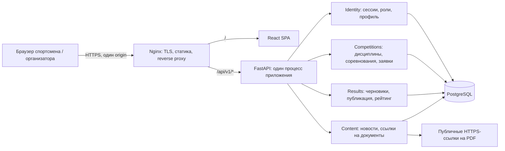
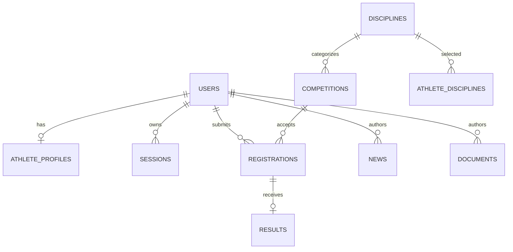

# ТехноСпортФест 2026 — архитектура до MVP

Статус: рабочее решение для старта команды. Основано на переданном ТЗ «Архитектура ТехноСпортФест 2026.md». Неизвестные организационные детали (домен, хостинг, даты сдачи, окончательный язык фронтенда) не блокируют контракт.

## 1. Схема размещения



**Nginx не авторизует пользователей.** Он обслуживает SPA, завершает TLS и передаёт `/api/v1` в FastAPI. Identity выдаёт серверную сессию в `HttpOnly; Secure; SameSite=Lax` cookie. FastAPI на каждом защищённом запросе проверяет сессию и роль. Для всех изменяющих запросов клиент передаёт `X-CSRF-Token`, полученный через `GET /api/v1/auth/csrf`; сервер также проверяет `Origin`. В разработке фронтенд проксирует `/api/v1` на API, сохраняя один origin. Пароли — Argon2id, сессии хранятся в БД как хеш токена, срок жизни 7 дней, при входе токен ротируется. Публичная регистрация всегда создаёт только `athlete`; организатор создаётся сидом/администратором вне публичного API.

**Уведомлений и брокера в MVP нет.** Единственный обязательный пользовательский сигнал — результат виден в интерфейсе после публикации. Если после MVP появятся email или push, модуль публикации запишет событие в outbox в той же транзакции, а отдельный worker отправит его. До появления реальной асинхронной задачи RabbitMQ/Redis добавят поддержку без пользы.

## 2. Границы модулей и данных

| Модуль / владелец | Таблицы | Публичный интерфейс внутри приложения |
|---|---|---|
| Identity / Б1 | `users`, `sessions`, `athlete_profiles`, `athlete_disciplines` | `current_user`, `require_role`, `get_athlete_summary` |
| Competitions / Б1 | `disciplines`, `competitions`, `registrations` | `get_registration`, `list_participants`, `complete_competition` |
| Results / Б2 | `results` | `list_published_results`, `rating_for_athlete` |
| Content / Б2 | `news`, `documents` | REST-контроллеры контента |

Модули импортируют сервисы соседнего модуля, не его ORM-модели и не пишут в чужие таблицы. Общая транзакция допускается через переданный `UnitOfWork`/DB session. Б1 владеет каркасом FastAPI, Alembic, настройками, Docker Compose и тестовым сидом. Б2 начинает со своих схем, сервисов и тестов на согласованном интерфейсе Competitions. Все миграции согласуются через один линейный Alembic head; разработчики не создают независимые head в общей ветке.

```mermaid
sequenceDiagram
    actor O as Организатор
    participant UI as React
    participant R as Results / Б2
    participant C as Competitions / Б1
    participant DB as PostgreSQL
    O->>UI: Опубликовать результаты
    UI->>R: POST /competitions/{id}/results/publish + cookie + CSRF
    R->>DB: BEGIN; блокировка соревнования
    R->>C: Проверить status=published и принадлежность заявок
    R->>DB: Опубликовать все черновики
    R->>C: complete_competition(id, тот же UnitOfWork)
    C->>DB: status=completed
    R->>DB: COMMIT
    R-->>UI: 200, опубликованные результаты
```

Рейтинг **вычисляется** из опубликованных результатов, а не хранит отдельные баллы: повторная публикация не начислит их второй раз. Внутри одного соревнования одна запись результата на заявку; допускаются одинаковые места. Участники без черновика результата остаются без результата. Публикация требует хотя бы один черновик, публикует все черновики атомарно, переводит соревнование в `completed`; повторный вызов возвращает `409`. После завершения запись результатов запрещена.

## 3. Данные и инварианты



- Все ID — UUID; даты — ISO 8601 UTC (`Z`); интерфейс показывает время в `Europe/Moscow` (Дагестан, UTC+3).
- `users.email` уникален без учёта регистра; `registrations(competition_id, athlete_id)` и `results.registration_id` уникальны.
- `registration_deadline <= starts_at < ends_at`; заявку принимает только спортсмен, когда соревнование `published` и текущее время строго раньше дедлайна.
- Соревнование проходит `draft -> published -> completed`; редактировать поля можно только в `draft`. В `completed` результаты доступны публично. Черновики доступны только организатору.
- Результат ссылается на заявку именно указанного соревнования. `place` — положительное целое. `scoreText` — необязательная строка для протокола; на рейтинг не влияет.
- Баллы за опубликованный результат: место 1 — 100; 2 — 70; 3 — 50; остальные — 20. Баллы суммируются по всем соревнованиям. При равенстве суммы место делится (`1, 1, 3`), стабильный порядок по ФИО и UUID. Фильтр по дисциплине пересчитывает сумму и места внутри выбранной дисциплины.
- Новости и документы публикуются сразу при создании; документы MVP — валидные публичные HTTPS-ссылки, загрузки файлов нет.

## 4. Версии и распределение

Версии ниже — этапы продукта. Контракт остаётся под `/api/v1`; несовместимое изменение API позже получит `/api/v2`.

| Версия | Б1 | Б2 | Фронтенд | Продакт / дизайн | Готово, когда |
|---|---|---|---|---|---|
| v1 — сквозной путь | Каркас, БД, сид, auth/CSRF, дисциплины, соревнования, заявки, участники | Черновик и публикация результата, публичные результаты, общий рейтинг | Вход, каталог/карточка, заявка, форма результатов, рейтинг; до API использует mock по OpenAPI | Макеты этих экранов, тексты ошибок/пустых состояний, сценарий демо | Спортсмен подал заявку; организатор опубликовал результат; рейтинг изменился |
| v2 — полный объём | Профиль, мои заявки, редактирование соревнования | Мои результаты, личный рейтинг, новости, документы | Кабинет спортсмена, контент, адаптивность, состояния ошибок | Проверяет оба пользовательских пути, контент, мобильный вид | Весь обязательный список ТЗ доступен через UI |
| v3 — MVP / сдача | Защита прав, миграции, сид и инструкция запуска | Проверки публикации/рейтинга, примеры данных | Проверка с чистой БД и сидом; полировка критических экранов | Приёмка и демонстрационный сценарий | Сквозной тест проходит в браузере, API совпадает с OpenAPI, нет критических дефектов |

### Параллельный старт

1. Все используют `contracts/openapi.yaml` как единственный внешний контракт. Изменение формы запроса/ответа — через PR с обновлённым примером, согласование Б1, Б2 и фронтенда до merge.
2. Б1 первым публикует миграции `users`, `disciplines`, `competitions`, `registrations` и интерфейс `get_registration`/`complete_competition`. Б2 может писать сервисы по интерфейсу и фикстурам до готовой БД.
3. Фронтенд генерирует типы из OpenAPI и начинает с `contracts/examples/`; `X-CSRF-Token` берётся до первого POST. Продакт фиксирует подписи, пустые состояния и ошибки для каждого экрана v1.
4. Интеграция v1 проверяет сценарий из ТЗ. Затем подключаются v2 разделы, затем приёмка v3.

## 5. Что сознательно отложено

Команды, онлайн-контесты, проверка кода, загрузка PDF, email/push-уведомления, брокер, отдельный сервис рейтинга и внешние интеграции. Для MVP они не участвуют в сквозном сценарии и не имеют API-контракта.
